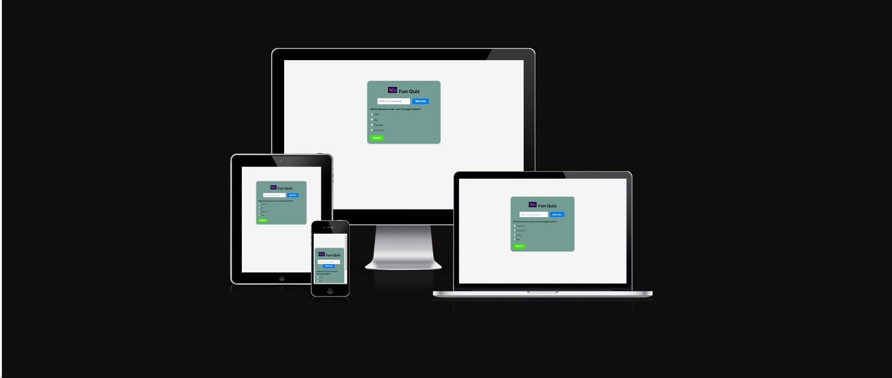
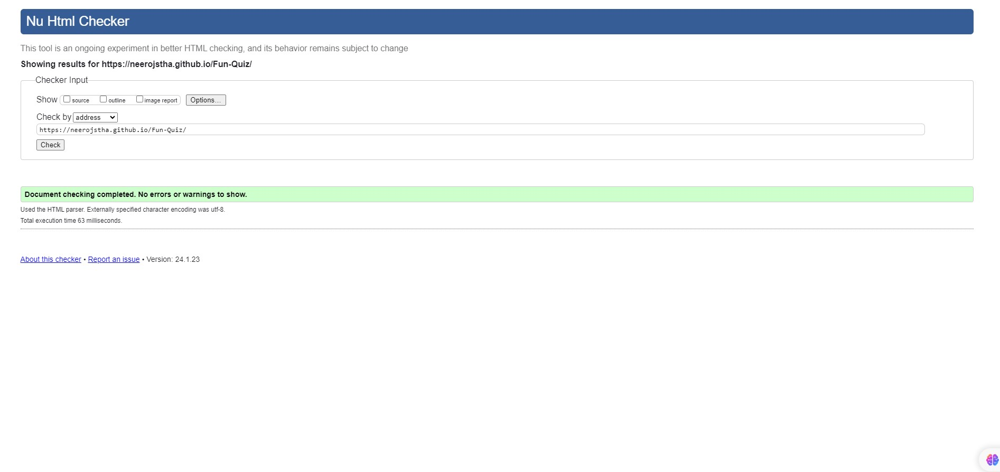
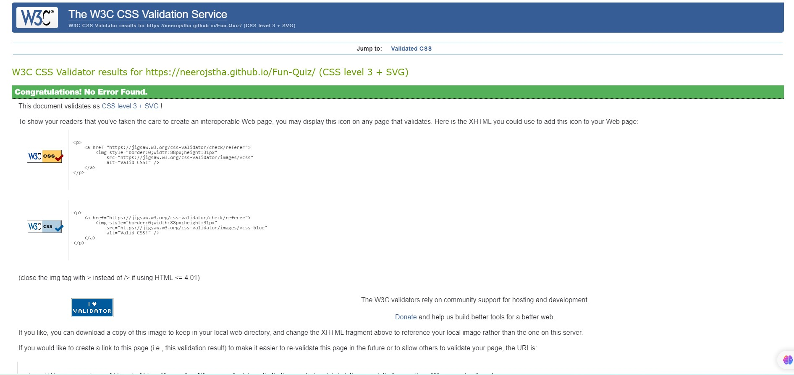
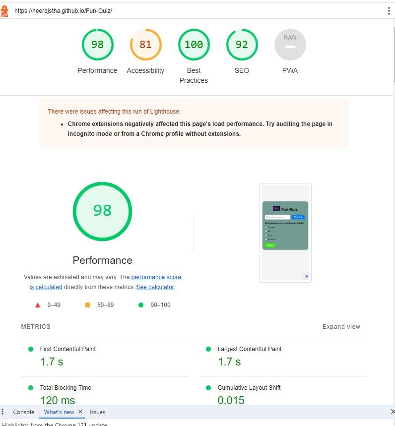

# Fun Quiz

## Overview
Fun Quiz is a web-based trivia game that challenges players with a variety of questions on different topics. It's designed to be interactive, user-friendly, and enjoyable for users of all ages.

## Features
- **User-Friendly Interface**: A clean and intuitive interface that is easy to navigate.
- **Dynamic Question Pool**: A range of questions covering various subjects.
- **Immediate Feedback**: Users receive immediate feedback on their answers.
- **Score Tracking**: The quiz keeps track of the user's score throughout the session.
- **Username Entry**: Users can enter their names to personalize the quiz experience.

## How to Play
1. **Enter Username**: Start by entering your username.
2. **Answer Questions**: Select your answer from the provided options for each question.
3. **Submit Answers**: Click on 'Submit' to confirm your answer.
4. **View Results**: At the end of the quiz, see your total score and review the answers.
5. **Retry or Review**: Choose to retry the quiz or review the answers to questions you missed.

## Technologies Used
- **HTML**: For structuring the web page.
- **CSS**: For styling the web page.
- **JavaScript**: For quiz functionality and interactivity.

## Performance/Testing
To run the quiz locally, follow these steps:
1. This pages tested in different browers such as chrome, firefox, safari and ms egde and working perfectly fine.
2. pages are clear, good looking and user friendly.

    - W3 Validator
    

    - Jigsaw css Validator
    

    - Lighthouse Test
    

## Bugs
- Slower to connect with browser
- Mobile screen compatiblity issues
## Deployment
- This pages are deployed in git hub pages and published
- site link : https://neerojstha.github.io/Fun-Quiz/

## Credits
- This pages html, css and javascript codes are inspired from love Maths project.
- Special thanks to my mentor Rahul Lakhanpal for mentoring me during this project.
